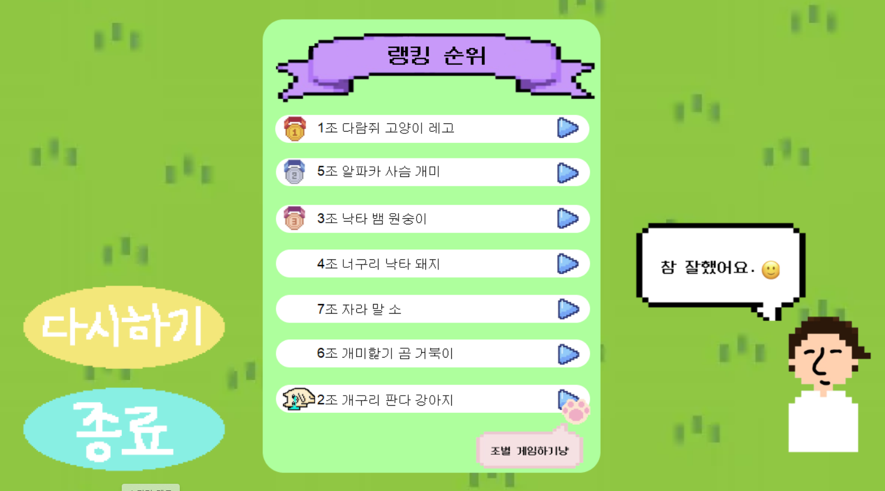

# 🌳누가누가 꼴찌할까❓🌳

## 💡 개요
- 삼성 청년 소프트웨어 아카데미(SSAFY) 1학기 토이 프로젝트
- 게임 이름 : 누가 누가 꼴찌할까? (벌칙게임)
- 게임 내용 : 끝날 때까지 끝난 게 아니다! 각종 함정 및 아이템들을 지나 도착 지점에 누가 꼴찌로 들어올까?
- 진행 기간 : 2024.10.05 ~ 2024.11.03
- 참여자 : 김경환, 전혜준, 최현정

## 📄 기획 배경
> 🗣 현재 우리 반에서 자주 이용하는 시중 웹 벌칙 게임에 반 모두가 불편함을 느꼈어요.

1. 한 팀을 뽑고, 그 팀 내에서 한명을 추가로 뽑고자 할 때의 과정이 복잡함 
    - 팀 수만큼 룰렛을 돌려 한 팀을 뽑고, 각 팀별로 팀원 이름을 입력하여 팀원 수만큼 다시 게임 실행 필요
2. 매번 사용자가 기존 입력 정보 지우고 다시 써야함
3. 광고를 매번 봐야함
4. 룰렛 속도가 점차 줄어들 때 결과가 어느정도 예측 가능하여 흥미가 줄어듦

> 🗣 그래서 저희는   **게임 실행 과정이 번거롭지 않고, 마지막까지 결과를 예측하기 어려워 끝까지 스릴있는** 저희반 맞춤형 벌칙 게임을 만들고자 했어요.
1. 버튼 클릭시 바로 팀전, 개인전 가능
2. 게임 초반에 한번만 팀 및 팀원 정보를 입력하면 됨
3. 기획부터 개발, A-Z까지 자체 제작이라 광고 없음
4. 다양한 함정 및 아이템 배치로 모든 캐릭터가 도착하기 직전까지 결과를 예상하기 어려움

## 🎮 게임 소개

### 게임 시나리오

### 라운드 구성
- **라운드 1.** 벌칙 `팀` 뽑기
> 1. 팀마다 팀원 이름 입력 (최대 7팀, 7명)
> - 입력한 팀원 이름 정보는 저장되어 라운드 2. 개인전에서 재입력 필요 없음
> 2. 캐릭터 랜덤 배정 및 팀 게임 진행
> 3. 팀 랭킹창 페이지 

|팀 정보 입력 페이지 | 벌칙 팀 뽑기 게임 페이지 | 팀 랭킹창 페이지 |
| ---------- | ------------------ |------------- |
|  |  |  |

- **라운드 2.** 벌칙 `팀원` 뽑기
> 1. 팀 뽑기 게임 종료 후, 랭킹창의 팀별 개인전 진행 버튼 클릭
> 2. 이전에 작성했던 팀원 이름으로 캐릭터 자동 생성됨
> 3. 캐릭터 랜덤 배정 및 팀원 게임 진행

| 팀 랭킹창 페이지 | 벌칙 팀원 뽑기 게임 페이지 | 팀원 랭킹창 페이지 |
| ---------- | ------------------ |------------- |
|  |  |  |

### UI
> 🗣 디자인 테마는 무엇인가요? 
- 대전 2반은 평소 서로를 귀여운 동물 친구들로 바라보는 분위기라는 점에서 착안하여 동물을 테마로 잡았어요.
- 실제 자연 경관이 아름다운 SSAFY 대전 캠퍼스를 재현했어요.

    

    

### 함정 및 아이템

| 아이템 | 설명 |  아이콘   |  실행 결과 |
|:-----:|-------|-------|:------:|
|황금 버섯|- 플레이어의 이동 속도가 5초간 빨라짐|||
| 독버섯 |- 플레이어의 이동 속도가 5초간 느려짐|||
| 거미줄 |- 거미줄에 먹이가 포획되는 것에 착안   - 플레이어의 이동이 5초간 정지됨|||
| 열기구 |- 열기구의 이동 특성에 착안   - 플레이어가 5칸 앞으로 이동|||
| 두더지 구멍 |- 동물이 구멍에 빠지는 효과 표현   - 플레이어가 다시 출발지로 이동|||
|  밤   | - 밤송이 가시가 뾰족한 것에 착안   - 뒤로 5칸 이동 ||     |
|  랜덤박스   | - 마지막까지 게임 결과를 예상하지 못하도록 플레이어간 순위를 무효화하는 아이템   - 효과 추측하지 못하도록 물음표 이미지 사용   1. 모든 플레이어가 출발지로 되돌아감   2. 모든 플레이어의 위치가 랜덤으로 뒤바뀜 |||

##  ⚙️ 기술 스택
### Environment
   

### Language

### Communication

 

## 🖇️ 협업 환경
- GitHub
    - 코드 버전 관리
    - 프로젝트 보드 활용하여 작업 내용 공유
    - 브랜치 전략
        - GitHub-Flow 전략 기반
        - master 브랜치와 master에 기능을 추가하기 위한 feature 브랜치 운용 

- Notion
    - 회의록 작성 
    - 에러 내용 및 해결방법 공유
    - 실시간 작업 내용 공유
    - git 작업 및 코드 파일 작성 규칙 정의
    - 기능 구현 위해 필요한 기술 내용 정리  
    - 간트차트를 통해 일정 관리

- Figma
    - 목업 제작
    - 디자인 작업 공유

## 👩‍👩‍👦 팀 구성 및 소감

| 이름    | GitHub 링크 | 역할         | 소감                                |
|------|--------|---------------------|---------------------|
| 김경환   | [@kimkyeonghwan-1](https://github.com/kimkyeonghwan-1) | 아이디어 기획  UI 및 설계 - 피그마 및 게임창 설계 - 아이템 이미지 선택 main함수 구현 -페이지 이동 설계 및 구현 코드 연결 및 최적화 -게임 로직 최적화 및 연결  -랭킹 로직 최적화 및 연결 -입력 정보 로직 최적화 및 연결  README 작성   | 우리 프로젝트의 목표는 관통과 2학기 프로젝트 시작 전 협업을 경험하는 것이었다.   노션 정리, UI설계, git관리, 코드 구현 모두 이번 프로젝트가 아니었으면 못했을 경험을 했다.    특히, 이번 프로젝트에서 가장 크게 느낀 것은 구현 단계에서 생성형 AI는 최고의 조력자가 될 수도 있고, 걸림돌이 될 수도 있다는 것이다.    이번 프로젝트에서 했던 노력과 경험으로 너무 많은 것을 얻었다. |
| 전혜준   | [@hyejoony](https://github.com/hyejoony/) | 아이디어 기획  게임 로직 초안 구현  -캐릭터 생성, 랜덤배치 및 이동  -아이템 랜덤 배치 및 생성  -캐릭터와 아이템 충돌시 이동 방향 변경  -랭킹창에서 팀별 개인전 연결 로직 구현  -플레이어 캐릭터 이동시 플레이어 이름 정보 따라다니게끔 구현  캐릭터 및 게임 페이지 디자인  README 작성 | 노션, git 작업, UI 개발, 코드 개발, 로직 연결 등    다양한 경험을 다함께 해보고자 했던 걸 이뤘다!    그리고 이런 팀원들이라면 다른 어떤 프로젝트도 재밌게 할 수 있을 것 같다 느꼈다! |
| 최현정 | [@shine8648](https://github.com/shine8648) | 아이디어 기획 및 구체화   - 사용자 입력 정보 처리 로직 구현   - 팀 정보 입력 페이지 구현   - 실시간 랭킹 업데이트 로직 구현,   - 아이콘, 캐릭터 및 게임 페이지 디자인   - README 작성 | 첫 번째 개발 프로젝트로서, 전반적인 프로젝트 진행과 협업 과정을 배울 수 있는 소중한 경험이었습니다.    특히, 프로젝트 초기 단계에서 체계적으로 설계하는 것이 중요하다는 것을 깨달았습니다.    좋은 팀원들과 함께 프로젝트를 함께 해서 무사히 끝마칠 수 있었던 것 같아 감사한 마음입니다.    앞으로 본격적인 교육 과정 프로젝트를 진행해 나가면서 어떤 부분에서 제가 더 많은 것을 기여할 수 있을지 고민해야 할 것 같습니다! 