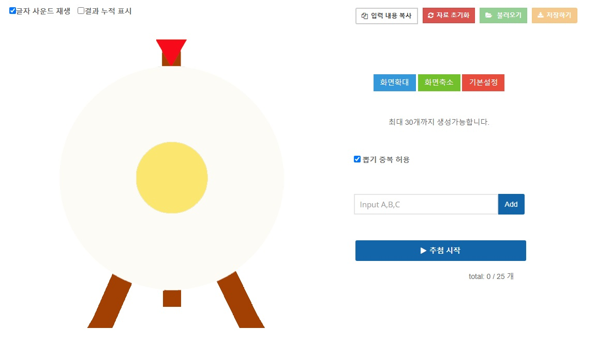
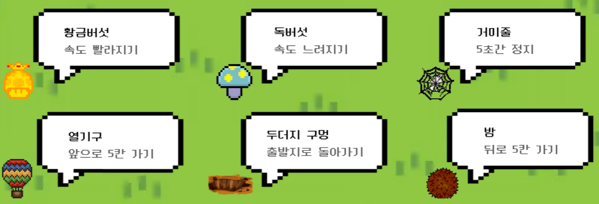
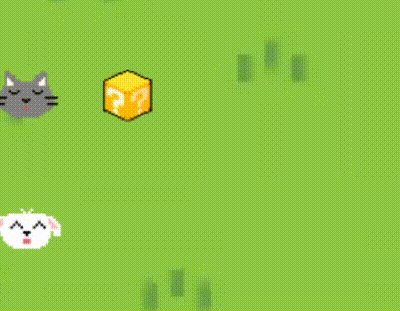
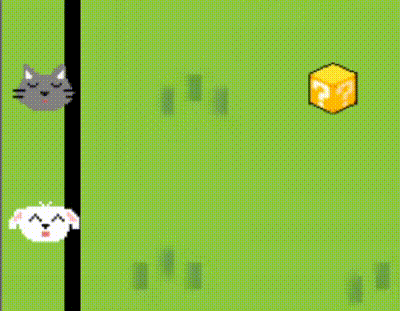

# 🌳누가누가 꼴찌할까❓🌳


## 💡 개요
- 삼성 청년 소프트웨어 아카데미(SSAFY) 1학기 토이 프로젝트
- 게임 이름 : 누가 누가 꼴찌할까
- 진행 기간 : 2024.10.05. ~ 2024.11.03.
- 참여자 : 김경환, 전혜준, 최현정


## 📄 기획 배경
> 🗣 삼성 청년 소프트웨어 아카데미(SSAFY)에서 교육을 듣는 저희는 팀 순서 별로 발표자를 정하기 위해 사용하던 룰렛 게임에서 불편함을 느꼈습니다.



> 🗣 팀 수만큼 룰렛을 돌려 발표 팀을 뽑고, 각 팀 별로 팀원 이름을 입력하여 팀원 수만큼 다시 게임을 실행해야 했습니다. 기존 입력 정보를 지우고 다시 쓰는 과정이 필요했습니다.


> 🗣 게임을 실행할 때마다 광고를 봐야하는 점과, 룰렛 속도가 줄어들면 결과를 어느 정도 예측한 점도 개선하고 싶었습니다.


> 🗣 그래서 저희는 <br> **1. 게임 실행 과정이 번거롭지 않고,** <br> **2. 마지막까지 결과를 예측하기 어려운** <br> SSAFY 전용 벌칙 게임을 만들고자 했습니다.


## 🎮 게임 소개
### 라운드 구성
- 벌칙 `팀` 뽑기
> 1. 팀 개수만큼 입력창 추가하여 팀 정보 입력 (최대 7개)
> 2. 팀별 팀원 이름 입력
> 3. 벌칙 팀 뽑기 게임 진행

|팀 정보 입력 페이지 | 벌칙 팀 뽑기 게임 페이지 | 팀 랭킹창 페이지 |
| ---------- | ------------------ |------------- |
| [teame_input_img](../img/README_img/team_input.png) | [teame_input_img](../img/README_img/team_input.png) |[teame_input_img](../img/README_img/team_input.png) |


- 벌칙 `팀원` 뽑기
> 1. 팀 뽑기 게임 종료 후, 랭킹창의 팀별 게임 진행 버튼 클릭
> 2. 이전에 작성했던 팀원 이름으로 캐릭터 자동 생성됨
> 3. 벌칙 팀원 뽑기 게임 진행

| 팀 랭킹창 페이지 | 벌칙 팀원 뽑기 게임 페이지 | 팀원 랭킹창 페이지 |
| ---------- | ------------------ |------------- |
| [teame_input_img](../img/README_img/team_input.png) | [teame_input_img](../img/README_img/team_input.png) |[teame_input_img](../img/README_img/team_input.png) |


- 참고
> - 팀 뽑기 게임만 진행 가능
> - 도착지에 들어온 순서대로 랭킹을 매김


### UI
<p align='center'>
    
</p>

### 장애물 시스템


| 아이템 | 설명 |  아이콘   |  실행 결과 |
|:-----:|----|-----|-----|
|황금 버섯|- 플레이어의 이동 속도가 5초간 빨라짐|||
| 독버섯 |- 플레이어의 이동 속도가 5초간 느려짐|||
| 거미줄 |- 거미줄에 먹이가 포획되는 것에 착안 <br> - 플레이어의 이동이 5초간 정지됨|||
| 열기구 |- 열기구의 이동 특성에 착안 <br> - 플레이어가 5칸 앞으로 이동|||
| 두더지 구멍 |- 동물이 구멍에 빠지는 효과 표현 <br> - 플레이어가 다시 출발지로 이동|||
|  밤   | - 밤송이 가시가 뾰족한 것에 착안 <br> - 뒤로 5칸 이동 ||     |
|  랜덤박스   | - 마지막까지 게임 결과를 예상하지 못하도록 플레이어간 순위를 무효화하는 아이템 <br > - 효과 추측하지 못하도록 물음표 이미지 사용 <br> 1. 모든 플레이어가 출발지로 되돌아감 <br> 2. 모든 플레이어의 위치가 랜덤으로 뒤바뀜 |||


<!-- 
<h4 align='center'>아이템 설명<h4>
<p align='center'>
    
</p>

<h4 align='center'>밤 | 거미줄 | 두더지 구멍<h4>
<p align='center'>
    
    
    
</p>

<h4 align='center'>열기구 | 독버섯 | 황금버섯<h4>
<p align='center'>
    
    
    
</p>


<h4 align='center'>랜덤(섞기) | 랜덤(초기화)<h4>
<p align='center'>
    
    
</p> -->


##  ⚙️ 기술 스택
### Environment
   

### Language


### Communication


## 🖇️ 협업 환경
- GitHub
    - 코드 버전 관리
    - 프로젝트 보드 활용하여 작업 내용 공유
    - 브랜치 전략
        - GitHub-Flow 전략 기반
        - master 브랜치와 master에 기능을 추가하기 위한 feature 브랜치 운용 

- Notion
    - 회의록 작성 
    - 에러 내용 및 해결방법 공유
    - 실시간 작업 내용 공유
    - git 작업 및 코드 파일 작성 규칙 정의
    - 기능 구현 위해 필요한 기술 내용 정리  
    - 간트차트를 통해 일정 관리

- Figma
    - 목업 제작
    - 디자인 작업 공유


## 📒 개발 노트
### 주요 기능
[기본 게임 개발 기술 정리](https://www.notion.so/116a826a50a48081a2a8c474ab13bd90?pvs=4)

### 에러 기록 및 해결
- canvas에 아이템 이미지들 로드시 모듈 에러 
1. 내용 : `TclError: image "pyimage5" doesn't exist`
```python
from PIL import Image, ImageTk  # PIL 라이브러리 import

# 게임 윈도우 생성 및 메인 루프 시작
root, canvas, players, items = create_game_window()
root.mainloop()

## -> TclError: image "pyimage5" doesn't exist
```
2. 해결 
```python
# 이미지 참조를 root 객체에 저장
# 전역변수처럼 활용되게 
root.images = []
items = create_items(canvas, item_info, root.images)
```

- 이미지 경로 관련 에러
1. 내용 : `TclError: couldn't open "bg_img/intro_page.png": no such file or directory`
```python
# 초기 페이지 배경 설정
img = tk.PhotoImage(file='bg_img/intro_page.png')
canvas.create_image(640, 360, image=img)
```
2. 해결

```python
img = tk.PhotoImage(file='../bg_img/intro_page.png')
```
```python
img = tk.PhotoImage(file='C:/path/to/your/bg_img/intro_page.png')
```

- 이미지 로드시 에러
1. 내용 : `TclError: couldn't open "bg_img/info_page.png": no such file or directory`
2. 해결
```python
# 루트 윈도우 생성 이후 객체 생성
def load_images():
    global img_objects
    img_objects = [
        tk.PhotoImage(file='../bg_img/info_page.png'),
        tk.PhotoImage(file='../icon_img/info.png')
    ]

# 메인 윈도우 생성
root = tk.Tk()
root.title("누가 누가 꼴찌할까 - 팀 정보 입력")

# 이미지 로드
load_images()
```


## 👩‍👩‍👦 팀 구성

| 이름     | GitHub 링크                     | 역할         | 소감                                |
|----------|---------------------------------|--------------|-------------------------------------|
| 김경환   | [GitHub](https://github.com/username1) |      |  |
| 전혜준   | [GitHub](https://github.com/username2) |       |  |
| 최현정  | [GitHub](https://github.com/username3) |     |  |
